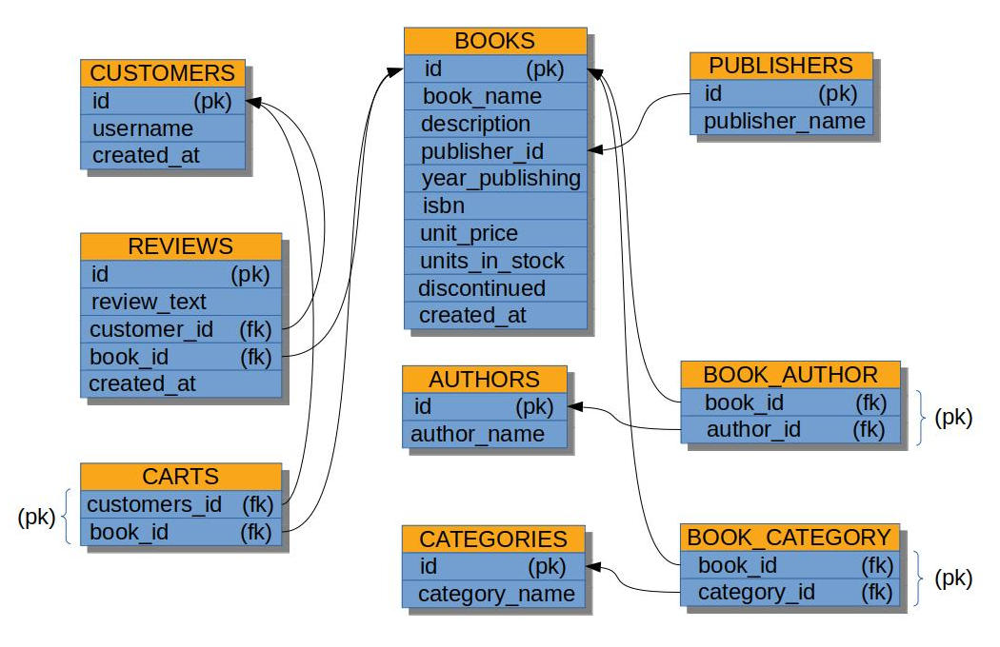

# postgresql_dumps

**About:** Dumps from PostgeSQL

**Description:** Different dumps from PostgreSQL

List of dumps:
  - clone_instagram_database.sql -- siplified clone of instagram's database. There is the full logical copy of this datebase for MySQL in https://github.com/maninserg/mysql_dumps;
  - books_shop.sql -- siplified database of a books shop; 

  

<b>The diagram of clone_instagram_database.sql</b>

  

<b>The diagram of books_shop.sql</b>

